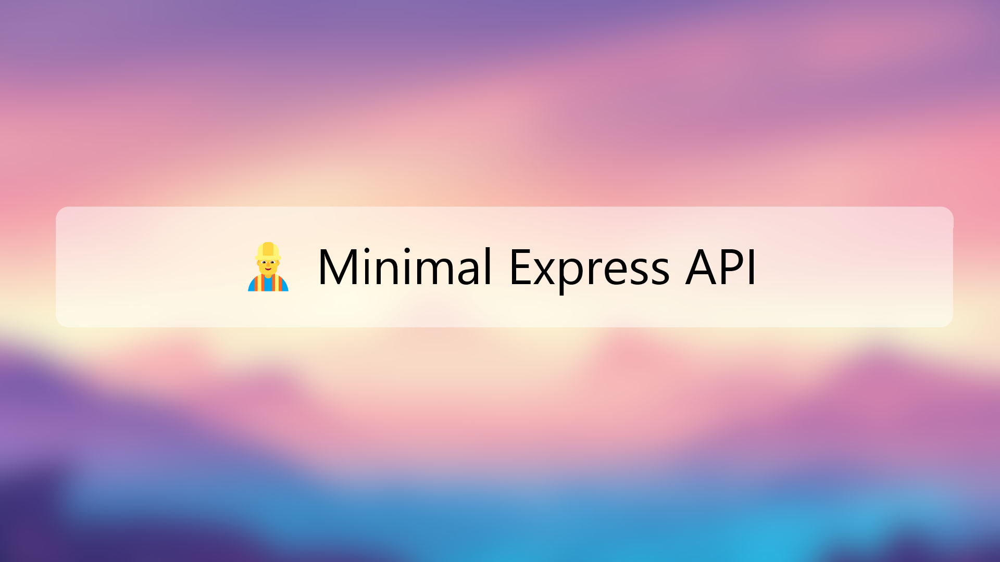

# Welcome to the Nau's Minimal Express Zod API Boilerplate!

Hey 👋! This is my opinionated boilerplate that I like to use for my own projects. It is a production-ready boilerplate (*although you should check everything by yourself*). 

It has the **minimum dependencies** and stuff already implemented since I don't like boilerplates with lots of things already done, I just want something minimal so I can avoid the boring stuff and jump right into **coding my ideas**!

## Features

 - **🤏 Minimal**: You have the bare minimum to start your API project. You can install any ORM you want, you can use any file structure you want...
 - **🦺 Typesafe**: I am using Typescript. Zod is also installed and everything is using it (including Express!).
 - **📝 Linted**: ESLint is configured with Prettier, rules are created and everything is working, even autoformatting. Now you don't have to enter in the settings nightmare anymore.
 - **📦 Production-ready Dockerization**: A Dockerfile is already created and optimized for production. It includes several stages so you can run it also for a development instance.
 - **📚 Auto docs generation**: Yeah, you heard it right. The boilerplate will generate OpenAPI 3 docs from your routes automatically!
 - **👤 Auto client generation**: Even better! Now you will have automatically generated a fully type safe file that you can drop into your front-end code and do API calls to the API without worrying about coding it!
 - **📄 Aliases support**: No more imports like "../../../../file"! Aliases are fully supported, both in dev and prod runtimes!
 - **🔥 Hot-reload**: In development, you will have hot-reload when you do file changes, as you deserve.
 - **➰ Multi-instance, auto-restart and dockerized**: In the Dockerized production build, you won't have to worry about instances, restarts... everything is already configured with PM2.

## Requeriments
✅ At least Node.js 16.X.X
✅ Docker in your system (only if you want to create Docker images)

## How to start?

Just clone this repo or click in the "Use template" button. Once you have it in your computer, install the dependencies. I recommend you to use npm if you plan to use the Dockerfile since the Dockerfile will use the `package-lock.json` from npm.

But, as always, feel free to use any package manager!

Remember, you can install the dependencies with:

    npm i

You have to create a .env file, just copy the one included as .env.example:

    cp .env.example .env
Once you have the .env file ready, it is time to rename the project.

## How to rename the project?
I have tried to reduce the changes you have to do by a lot but still you have to change some files.
First, in the `package.json` file, change the name of the project in the **line 2**.
In the **same file**, in the **lines 20, 21, 22 and 23**; change the project name from **naucode/express-typescript-boilerplate-api** to your project name.
In the `.env` file, make sure to change the **API_TITLE** to your project name.
Finally, in the **line 13** in the file `./src/models/app.ts`, change the text from '**express-typescript-boilerplate-api**' to your project name.
To finish, **reinstall the dependencies** (for example with `npm i`) and you will have finished!

## Available .env Settings
|Name  |Description  |
|--|--|
|PORT  |[Number] It is the port the API will use (*except if you run it from Docker, then you will need to configure the port inside the Dockerfile*). By default it is **8090**.  |
|CORS_ENABLED|[Boolean] Enable or disable CORS in the API. By default it is **true**.|
|LOG_LEVEL|['debug','warn','silent'] The log level used in the API logs. By default it is '**debug**'|
|LOG_COLORED|[Boolean] Just if the logs are colored or not. By default it is **true**.|
|COMPRESSION_ENABLED|[Boolean] Enable or disable the use of compression in the responses. By default is is **true**.|
|UPLOAD_ENABLED|[Boolean] Enable or disable the support of file uploads. By default it is **true**.|
|GENERATE_CLIENT|[Boolean] Enable or disable the automatic generation of the client.ts file every time the server runs. It is **true** by default but it will only run automatically when launching a development server. For production server, you will have to run the command manually (*check the scripts section*).|
|GENERATE_API_DOCS|[Boolean] Enable or disable the automatic generation of the OpenAPI V3 docs every time the server runs. It is **true** by default but it will only run automatically when launching a development server. For production server, you will have to run the command manually (*check the scripts section*).|
|API_VERSION|[String] The API version. It is just used in the generated docs. By default it is '**0.0.1**'.|
|API_TITLE|[String] The API title. It is used only in the generated docs. By default it is your **project name**.|
|API_SERVER_URL|[String] The API URL. It is used only in the generated docs but you don't need a working URL, only if you want to use those docs to call the API directly. By default it is '**http://api.example.com/v1**'|

## Available Scripts
| Name | Description |
|--|--|
| npm run **clean** | It removes the `./dist` folder, the generated client file at `./src/client/client.ts` and the generate docs at `./src/docs/api.yaml` |
| npm run **test** | It runs the tests (*if there are any*). |
| npm run **build** | It creates a production build at `./dist` |
| npm run **start** | It starts the production build at `./dist` |
| npm run **dev** | It starts the development environment **with** hot-reload enabled |
| npm run **dev:no-reload** | It starts the development environment **without** hot-reload enabled |
| npm run **lint** | It runs the linter |
| npm run **lint:fix** | It runs the linter but fixing any auto-fixable issue it finds |
| npm run **generate:client** | It generates the client file at `./src/client/client.ts` (*check the "What is the client file?" section*) |
| npm run **generate:docs** | It generates the OpenAPI V3 docs file at `./src/docs/api.yaml` (*check the "What is the docs file?" section*) |
|npm run **docker:build** | It generates a Docker image ready for **production** |
|npm run **docker:run** | It runs the latest **production** Docker image |
|npm run **docker:build:dev** | It generates a **development** Docker image |
|npm run **docker:run:dev** | It runs the latest **development** Docker image without hot-reload (*so you can use it in a staging server*)|

## What is the client file?
As we said previously, to make your life easier, we can generate automatically a **typesafe** file that you can just drag into your front-end project and do all the API calls by using some already coded functions.

The file that you have to copy to your front-end project is the one at `./src/client/client.ts`.

When you launch a development server (*for example with `npm run dev`*), if your `.env` file has the property `GENERATE_CLIENT` as `true` (*it is like that by default*), the system will regenerate the `client.ts` file.

When launching the production build, **it won't generate it** but you can always generate it by yourself by running the `npm run generate:client` command.

To achieve this generation, we are using the express-zod-api under the hood, so make sure to check [this link](https://github.com/RobinTail/express-zod-api#generating-a-frontend-client) for a (*way better*) explanation about how to use the generated file in your front-end.

## What is the docs file?
Just like with the client file, we also generate an OpenAPI V3 docs file for you. 

Like in the client file generation, it is done automatically when running the development server but if you want to run it by yourself, you can with the command `npm run generate:docs`.

The file is at `./src/docs/api.yaml`. You can serve that file in a Swagger endpoint, open it [in Postman](https://learning.postman.com/docs/designing-and-developing-your-api/importing-an-api/), or even check it online [here](https://editor.swagger.io/).

## How to....?
Even if I tried to keep the dependencies low and the code complexity to a minimum, starting with a boilerplate can be complicated.

I haven't implemented things like middlewares, authentication systems, ORMs... so you can add whatever you want.

But you have examples of everything here and there, so you are not left in an empty project. For example, you have a little middleware implementation, so you can create your owns. Basically, the template has several files here and there that you can use to learn how to use everything.

Finally, as always, I recommend you to check the docs of the dependencies, that always help.

## Docs & Dependencies
- [Express Zod API Docs](https://github.com/RobinTail/express-zod-api)
- [Zod Docs](https://zod.dev/)
- [TS Reset Docs](https://github.com/total-typescript/ts-reset)
- [ZNV Docs](https://github.com/lostfictions/znv)